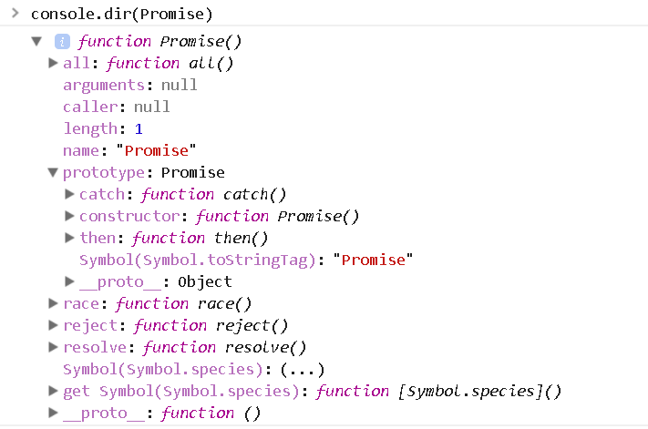
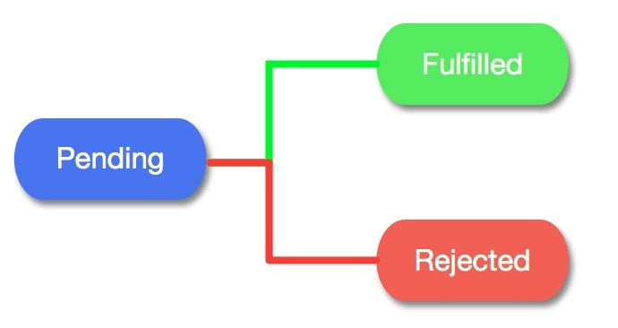

# Promise

## Promise是什么

---

### 回调函数
```php
setTimeout(function () {
console.log('callback...');
}, 1000);
```
此延时定时器中的function就是我们常说的回调函数，回调函数常常满足三个特征
- 我们自己定义的
- 我们自己没去执行
- 最终被其它人（浏览器的ajax模块，定时器模块...）执行了

### 回调地狱
```javascript
transformData(layersSource, function (protocoldata) {
takePicture(event, function (pngData) {
//dosomething();
})
});
```
- 说明：回调函数是异步的，在上面的代码中每一层的回调函数都需要依赖上一层的回调执行完，所以形成了层层嵌套的关系,如果回调层数过多最终形成回调地狱
- 弊端：代码阅读和维护比较麻烦
那有没有其它解决的办法呢？？？

### Promise是对象？函数？数组？


- Promise是一个构造函数，自己身上有all、reject、resolve这几个方法，原型上有then、catch方法;
- Promise的构造函数接收一个参数，是函数，并且传入两个参数：resolve，reject，分别表示异步操作执行成功后的回调函数和异步操作执行失败后的回调函数
- 用Promise的时候一般是包在一个函数中，在需要的时候去运行这个函数
- 执行这个函数我们得到了一个Promise对象,同时也就可以使用他的then和catch方法了
```javascript
function testPromise(){
var p = new Promise(function(resolve, reject){
//做一些异步操作
setTimeout(function(){
console.log('执行完成');
resolve('随便什么数据');
}, 2000);
});
return p; 
}

testPromise().then(function(data){
console.log(data);
//后面可以用传过来的数据做些其他操作
});

```

## Promise原理分析


其实promise原理说起来并不难，它内部有三个状态，分别是pending，fulfilled和rejected 。
pending是对象创建后的初始状态，当对象fulfill（成功）时变为fulfilled，当对象reject（失败）时变为rejected。且只能从pengding变为fulfilled或rejected ，而不能逆向或从fulfilled变为rejected 、从rejected变为fulfilled

---

## Promise实例方法介绍
