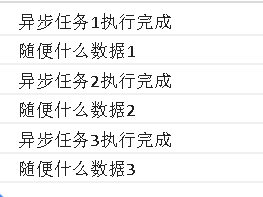

# Promise

## Promise是什么

---

### 回调函数
```php
setTimeout(function () {
console.log('callback...');
}, 1000);
```
此延时定时器中的function就是我们常说的回调函数，回调函数常常满足三个特征
- 我们自己定义的
- 我们自己没去执行
- 最终被其它人（浏览器的ajax模块，定时器模块...）执行了

### 回调地狱
```javascript
transformData(layersSource, function (protocoldata) {
takePicture(event, function (pngData) {
//dosomething();
})
});
```
- 说明：回调函数是异步的，在上面的代码中每一层的回调函数都需要依赖上一层的回调执行完，所以形成了层层嵌套的关系,如果回调层数过多最终形成回调地狱
- 弊端：代码阅读和维护比较麻烦
那有没有其它解决的办法呢？？？

### Promise是对象？函数？数组？


- Promise是一个构造函数，自己身上有all、reject、resolve这几个方法，原型上有then、catch方法;
- Promise的构造函数接收一个参数，是函数，并且传入两个参数：resolve，reject，分别表示异步操作执行成功后的回调函数和异步操作执行失败后的回调函数
- 用Promise的时候一般是包在一个函数中，在需要的时候去运行这个函数
- 执行这个函数我们得到了一个Promise对象,同时也就可以使用他的then和catch方法了

```javascript
function testPromise(){
var p = new Promise(function(resolve, reject){
//做一些异步操作
setTimeout(function(){
console.log('执行完成');
resolve('随便什么数据');
}, 2000);
});
return p; 
}

testPromise().then(function(data){
console.log(data);
//后面可以用传过来的数据做些其他操作
});

```

## Promise原理分析


其实promise原理说起来并不难，它内部有三个状态，分别是pending，fulfilled和rejected 。
pending是对象创建后的初始状态，当对象fulfill（成功）时变为fulfilled，当对象reject（失败）时变为rejected。且只能从pengding变为fulfilled或rejected ，而不能逆向或从fulfilled变为rejected 、从rejected变为fulfilled

---

## Promise实例方法介绍

### then：链式操作方法，简化层层回调
```javascript
function runAsync1(){
    var p = new Promise(function(resolve, reject){
        //做一些异步操作
        setTimeout(function(){
            console.log('异步任务1执行完成');
            resolve('随便什么数据1');
        }, 1000);
    });
    return p;            
}
function runAsync2(){
    var p = new Promise(function(resolve, reject){
        //做一些异步操作
        setTimeout(function(){
            console.log('异步任务2执行完成');
            resolve('随便什么数据2');
        }, 2000);
    });
    return p;            
}
function runAsync3(){
    var p = new Promise(function(resolve, reject){
        //做一些异步操作
        setTimeout(function(){
            console.log('异步任务3执行完成');
            resolve('随便什么数据3');
        }, 2000);
    });
    return p;            
}
```
执行下面的代码：
```javascript
runAsync1()
.then(function(data){
    console.log(data);
    return runAsync2();
})
.then(function(data){
    console.log(data);
    return runAsync3();
})
.then(function(data){
    console.log(data);
});
```

执行结果：



### reject： 如果执行失败，就可以在then中进行捕获
```javascript
function getNumber(){
    var p = new Promise(function(resolve, reject){
        //做一些异步操作
        setTimeout(function(){
            var num = Math.ceil(Math.random()*10); //生成1-10的随机数
            if(num<=5){
                resolve(num);
            }
            else{
                reject('数字太大了');
            }
        }, 2000);
    });
    return p;            
}

getNumber()
.then(
    function(data){
        console.log('resolved');
        console.log(data);
    }, 
    function(reason, data){
        console.log('rejected');
        console.log(reason);
    }
);
```

### all用法
```javascript
Promise
.all([runAsync1(), runAsync2(), runAsync3()])
.then(function(results){
    console.log(results);
});
```

- Promise的all方法提供了并行执行异步操作的能力，并且在所有异步操作执行完后才执行回调
- all接收一个数组参数，里面的值最终都算返回Promise对象。这样，三个异步操作的并行执行的，等到它们都执行完后才会进到then里面
- 使用场景：有了all，你就可以并行执行多个异步操作，并且在一个回调中处理所有的返回数据

### race用法
```javascript
//请求某个图片资源
function requestImg(){
    var p = new Promise(function(resolve, reject){
        var img = new Image();
        img.onload = function(){
            resolve(img);
        }
        img.src = 'xxxxxx';
    });
    return p;
}

//延时函数，用于给请求计时
function timeout(){
    var p = new Promise(function(resolve, reject){
        setTimeout(function(){
            reject('图片请求超时');
        }, 5000);
    });
    return p;
}

Promise
.race([requestImg(), timeout()])
.then(function(results){
    console.log(results);
})
.catch(function(reason){
    console.log(reason);
});
```

- all方法的效果实际上是「谁跑的慢，以谁为准执行回调」，那么相对的就有另一个方法「谁跑的快，以谁为准执行回调」，这就是race方法
- 这个操作特别像从服务端请求一张图片资源，如果超时则为失败，如果正常，加载图片

### catch用法
```javascript
getNumber()
.then(function(data){
    console.log('resolved');
    console.log(data);
})
.catch(function(reason){
    console.log('rejected');
    console.log(reason);
});


getNumber()
.then(function(data){
    console.log('resolved');
    console.log(data);
    console.log(somedata); //此处的somedata未定义
})
.catch(function(reason){
    console.log('rejected');
    console.log(reason);
});
```
- 它和then的第二个参数reject一样，用来指定reject的回调
- 在执行resolve的回调（也就是上面then中的第一个参数）时，如果抛出异常了（代码出错了），不会报错卡死，而是会进到这个catch方法中


